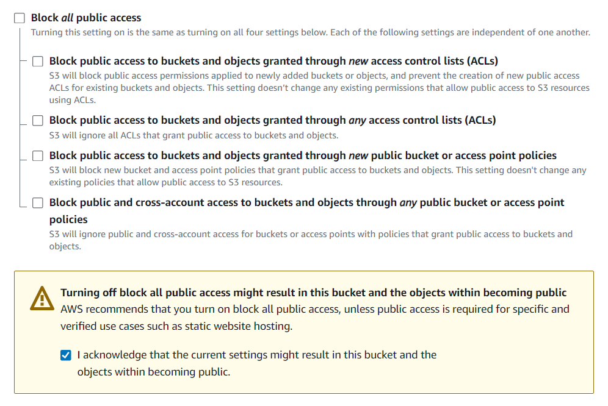
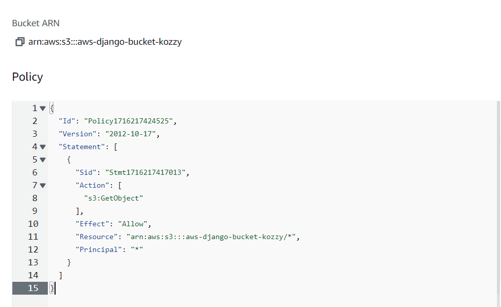
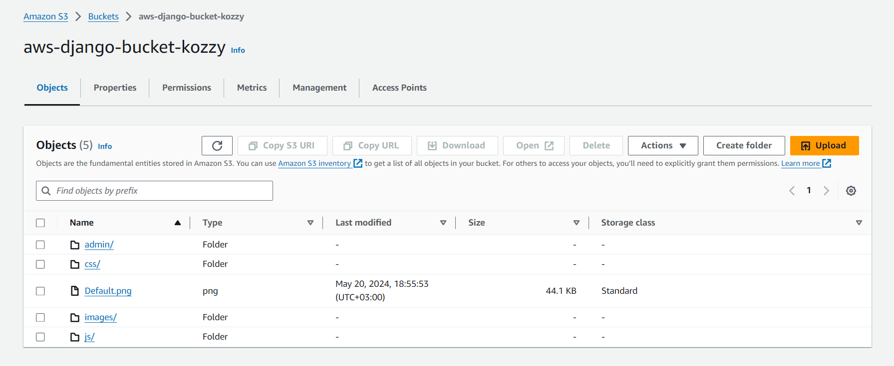

## Amazon Simple Storage Service
1. Amazon simple storage service allows you to keep files in directories

>>>> Directories are called Buckets.

>>>> files are called Objects.

2. It is commonly used to keep(store) images, static files(Javascript, Css, videos etc)

3. Use cases
 >> * Backup
 >> * Storage
 >> * Static Websites
 >> * Disaster Recovery
 
 4. When creating an s3 bucket make sure that
 >> * The bucket name is unique
 >> * Block Public Access is turned off to give access to your bucket :point_down:

>> 


 >> * You can also create a buckey policy like :point_down:
 >> * 

 >> This bucket policy allows anyone("Principal": "*") read access ("Action": "s3:GetObject") to files

 ## Integration Into Your App (Django App)

 1. Boto3
 >> 

>> is an aws software development kit (SDK) for Python that 
>> allows  you to write software that uses services like Amazon S3 and Amazon EC2.

 2. Django Storages

 >> 

>>  provides a variety of storage backends in a single library.


3. In settings.py 

>>>> make sure to add 'storages'


4. 

## AWS S3 configuration

```
AWS_ACCESS_KEY_ID = ''
AWS_SECRET_ACCESS_KEY = ''

AWS_STORAGE_BUCKET_NAME = '' # - Enter your S3 bucket name HERE

```

## Django 4.2 > Storage configuration for S3

```
STORAGES = {
    
    # Media file (image) management

    "default": {
        "BACKEND": "storages.backends.s3boto3.S3StaticStorage",
    },
    
    # CSS and JS file management

    "staticfiles": {
        "BACKEND": "storages.backends.s3boto3.S3StaticStorage",
        
    },
    
}

AWS_S3_CUSTOM_DOMAIN = '%s.s3.amazonaws.com' % AWS_STORAGE_BUCKET_NAME # Custom URL for accessing files on S3

AWS_S3_FILE_OVERWRITE = False  # Do not overwrite files with the same name, keep both files

```

5. Finally

>>> To upload all the files to s3

>>> On your terminal enter ` python manage.py collectstatic `

 >> 

 ##### Sources

 >>>> * [AWS Documentation](https://docs.aws.amazon.com/AmazonS3/latest/userguide/Welcome.html)

 >>>> * [Python Django For AWS Development - Mastery Course - Part 1](https://www.udemy.com/course/python-django-for-aws-development-mastery-course-part-1/?kw=arno&src=sac)

  >>>> * [Ultimate AWS Certified Developer Associate 2024 NEW DVA-C02](https://www.udemy.com/course/aws-certified-developer-associate-dva-c01/?kw=aws+develop&src=sac&couponCode=LEADERSALE24TRFR)

