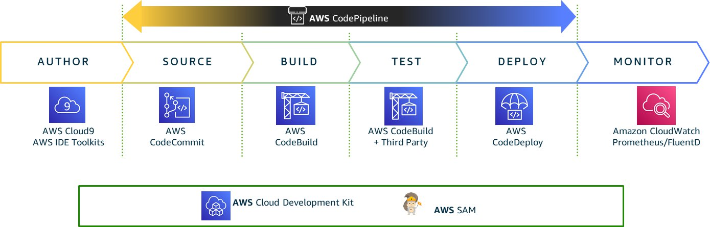

# Continious Integration And Continous Delivery

* It is a software development practice where updates to code are made often in a trustworthy way.

#### AWS CodeCommit

* A 'git-hub' like repository where we can keep our code.

* It is a source-control service that uses git technology.

* It is fully managed, scalable and highly available.

#### AWS CodeBuild 

* A service that collects and puts source code, runs tests and producing packages.

* These packages are sent to CodeDeploy to wait for deployment.

#### AWS CodeDeploy 

* Is a service that allows the deployment or re-deployment of an application quickly.

* Having blue/green deployment ensures that an application is not disrupted.

 ##### Sources
 >>>> * [AWS Documentation](https://docs.aws.amazon.com/whitepapers/latest/cicd_for_5g_networks_on_aws/cicd-on-aws.html)

 >>>> * [Python Django For AWS Development - Mastery Course - Part 1](https://www.udemy.com/course/python-django-for-aws-development-mastery-course-part-1/?kw=arno&src=sac)

  >>>> * [Ultimate AWS Certified Developer Associate 2024 NEW DVA-C02](https://www.udemy.com/course/aws-certified-developer-associate-dva-c01/?kw=aws+develop&src=sac&couponCode=LEADERSALE24TRFR)