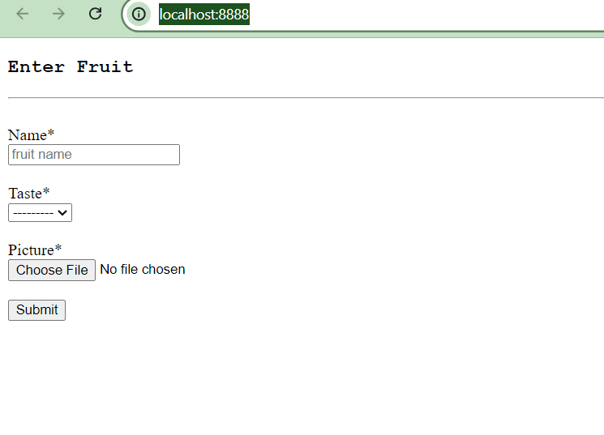

## Docker

1. Docker is a software platform that is used for deploying applications.

2. Applications are packaged into containers and can be easily run on any machine and without compatibility issues

### Some Terminologies 

#### Dockerfile 

A text fle that has instructions and arguments that tell Docker how the image should be built.


#### Image 

It is a read-only template with instructions for creating a container. Each instruction in a Dockerfile creates a layer in the image.


#### Container 

It is a running instance of an image. It is well defined by its image as well as any configuration options provided to create or start.


#### How Does Docker Work ?

1. Create a Docker file
2. Build Docker file into Docker image
3. Push the Docker image to a Docker image repository (Elastic Container Registry or dockerhub)
4. Pull the Docker image from our docker image repository

5. Run the Docker image

#### Set Up

a. In your project create a Dockerfile

b. Check for an [Operating System for the Dockerfile](https://hub.docker.com/)
>>> For Python recommended versions to choose from (bookworm, slim-bookworm, bullseye, slim-bullseye)

#### Dockerfile Instructions 

| INSTRUCTION | DESCRIPTION |
|----------|----------|
| FROM  | Used to set the base image   |
| MAINTAINER   | Used to set the    |
| RUN   | Used to run specific commands and be used many times   |
| ENV  | Used to set an environment variable   |
| ADD/COPY    | Used to copy files/directories into the file system of the container   |
| CMD  | Used to set a command to be executed when running a container   |


##### In your Dockerfile 
```
FROM python:3.11-bullseye

ENV PYTHONUNBUFFERED=1

WORKDIR /django_aws_project

COPY requirements.txt .

RUN pip3 install -r requirements.txt

COPY . .

CMD python manage.py runserver 0.0.0.0:8000
```


c. Build a Docker image
  Enter ` docker build - project_name ` on the command line


d. Run a Docker Container 
Enter ` docker run - p 8888:8000 ` on the command line




 ##### Sources

 >>>> * [Medium Blog Post](https://blog.devgenius.io/containerize-a-python-application-using-docker-f8cea56568dd)

 >>>> * [Python Django For AWS Development - Mastery Course - Part 1](https://www.udemy.com/course/python-django-for-aws-development-mastery-course-part-1/?kw=arno&src=sac)
