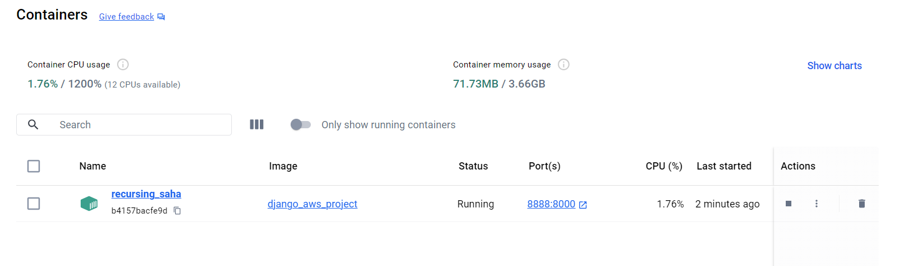
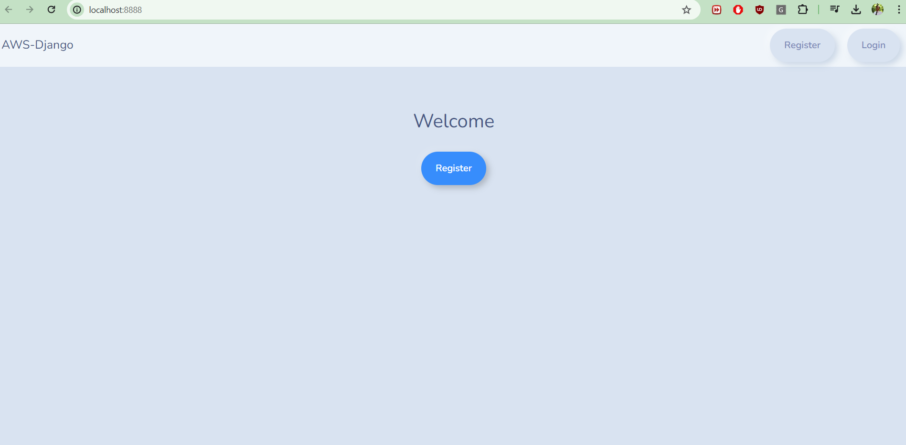

## Docker

1. Docker is a software platform that is used for deploying applications.

2. Applications are packaged into containers and can be easily run on any machine and without compatibility issues


#### How Does Docker Work ?

1. Create a Docker file
2. Build Docker file into Docker image
3. Push the Docker image to a Docker image repository 4. (Elastic Container Registry or dockerhub)
4. Pull the Docker image from our docker image repository

5. Run the Docker image

#### Set Up

a. In your project create a Dockerfile

b. Check for an [Operating System for the Dockerfile](https://hub.docker.com/)
>>> For Python recommended versions to choose from (bookworm, slim-bookworm, bullseye, slim-bullseye)


##### In your Dockerfile 
```
FROM python:3.11-bullseye

ENV PYTHONUNBUFFERED=1

WORKDIR /django_aws_project

COPY requirements.txt .

RUN pip3 install -r requirements.txt

COPY . .

CMD python manage.py runserver 0.0.0.0:8000
```


c. Build a Docker image
  Enter ` docker build - project_name ` on the command line


d. Run a Docker Container 
Enter ` docker run - p 8888:8000 ` on the command line




 ##### Sources

 >>>> * [AWS Documentation](https://aws.amazon.com/docker/)

 >>>> * [Python Django For AWS Development - Mastery Course - Part 1](https://www.udemy.com/course/python-django-for-aws-development-mastery-course-part-1/?kw=arno&src=sac)

  >>>> * [Ultimate AWS Certified Developer Associate 2024 NEW DVA-C02](https://www.udemy.com/course/aws-certified-developer-associate-dva-c01/?kw=aws+develop&src=sac&couponCode=LEADERSALE24TRFR)